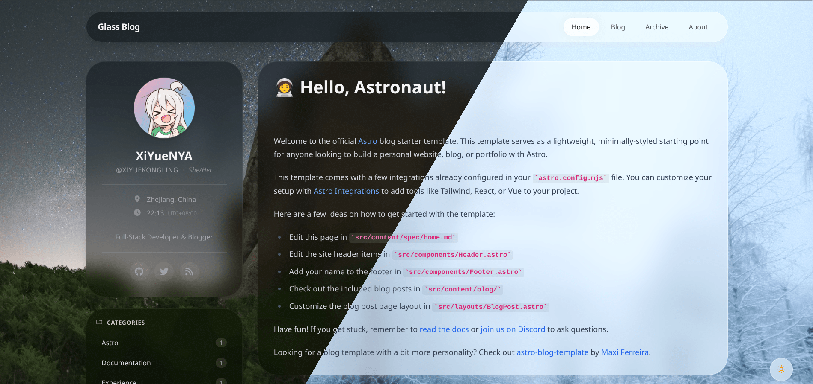

# 🧊 Glass Blog

A modern, minimalist blog theme built with **Astro 5** and **Tailwind CSS 4**, featuring a sleek "Glassmorphism" design aesthetic.

> [!CAUTION]
> **Work in Progress**: This project is under active development. The UI, components, and overall structure are subject to frequent changes.

---

## 📸 Preview




> *Modern glassmorphism interface with dynamic light/dark mode support.*

---

## ✨ Features

- **🚀 Astro 5**: Powered by the latest Content Layer API and View Transitions for a seamless SPA-like experience.
- **⚛️ Hybrid Framework Support**: Seamlessly integrates both **React 19** and **Vue 3** components within the same project.
- **🎨 Tailwind CSS 4**: Built with the next-generation utility-first CSS engine.
- **🪟 Glassmorphism UI**: A beautiful, frosted-glass interface designed for both light and dark modes.
- **📝 Enhanced Content Experience**:
    - **Interactive TOC**: Scroll-spy enabled Table of Contents.
    - **Image Lightbox**: Smooth, high-performance image zooming.
    - **Code Snippets**: Shiki-powered syntax highlighting with a built-in copy-to-clipboard feature.
- **📈 SEO & Performance**: Optimized with automatic sitemaps, RSS feeds, and responsive image processing.

---

## 🛠️ Tech Stack

- **Framework**: [Astro 5](https://astro.build/)
- **UI Libraries**: [React 19](https://react.dev/) & [Vue 3](https://vuejs.org/)
- **Styling**: [Tailwind CSS 4](https://tailwindcss.com/)
- **Animations**: [Framer Motion](https://www.framer.com/motion/)
- **Icons**: [FontAwesome 7](https://fontawesome.com/)
- **Typography**: Atkinson Hyperlegible

---

## 🚀 Getting Started

### Prerequisites

- Node.js (Latest LTS recommended)
- npm / pnpm / yarn

### Installation

1. **Clone the repository**

2. **Install dependencies**
   ```bash
   pnpm install
   ```

3. **Start development server**
   ```bash
   pnpm run dev
   ```

4. **Build for production**
   ```bash
   pnpm run build
   ```

---

## ⚙️ Configuration

You can customize the site title, author information, social links, and localization in `src/consts.ts`:

```typescript
// src/consts.ts
export const SITE_TITLE = "Glass Blog";
export const SITE_AUTHOR = "Your Name";
export const SITE_LANGUAGE = "en";
// ...
```

---

## 📄 License

This project is licensed under the [MIT](LICENSE) license.

---

## 🤝 Contributing

As this project is in its early stages, feedback and contributions are highly appreciated. Feel free to open an issue or submit a pull request.
